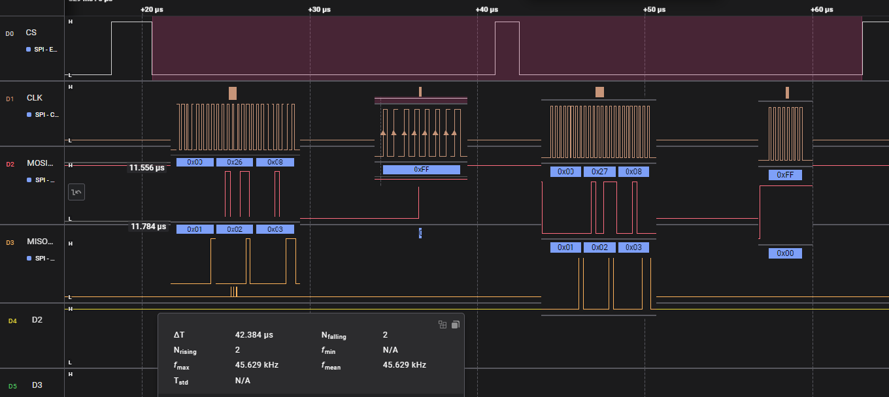
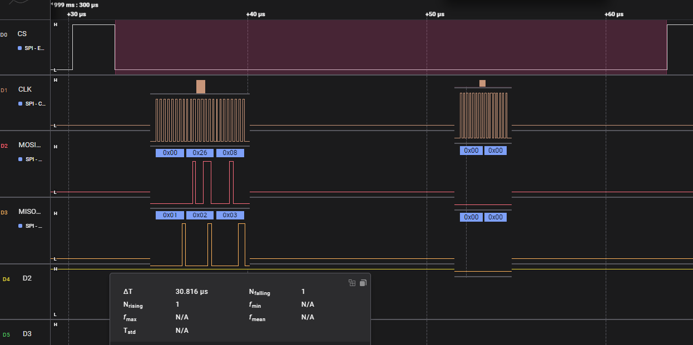

# Optimized Network Communication: A Comparative Analysis of TCP Iperf Server Performance using Nucleo-F412 and W5500 Ethernet Shield

## Introduction

The field of network communication technology is continually evolving. In this project, we implemented a TCP Iperf server using the Nucleo-F412 and W5500 Ethernet Shield. Our focus was to improve upon the existing ioLibrary method for reading 16-bit registers and analyze the impact on network performance.

## Comparison of the Old and New Methods

### The Old Method
In the original ioLibrary method, 16-bit registers were read in two 8-bit increments, which were then combined for use. While this method was simple and reliable, it required more time to read the data.

### The New Method
In our newly implemented approach, we developed a function that reads 16-bit registers in a single operation. This method has the potential to reduce data processing time significantly.

## Performance Analysis through Waveform Comparison

To clearly understand the performance difference between the two methods, we used waveform comparison. This allowed us to visually analyze the data transmission speed and efficiency. We meticulously observed the changes in signal and data transmission speed for each method.

## Iperf Test and Speed Measurement

We conducted TCP Iperf tests with the socket's nodelay option enabled, focusing on the use or absence of the 16-bit register read function. Additionally, we measured the differences in network speed depending on the use of interrupts. This enabled us to assess the performance in real network conditions.

## Conclusion and Future Prospects

A key finding from this experiment is that reading 16-bit registers in one operation can significantly enhance data processing speed. Such optimization is particularly beneficial in applications requiring high-speed network communication. We look forward to seeing these optimization methods being more widely applied in the future.

## Set Peripherals & Code

SPI Clock : 50Mhz

16bit Read Function in W5500.c
<pre><code>
uint16_t WIZCHIP_READ_16(uint32_t AddrSel)
{
   uint8_t ret[2];
   uint8_t spi_data[3], pBuf[2];

   WIZCHIP_CRITICAL_ENTER();
   WIZCHIP.CS._select();

   AddrSel |= (_W5500_SPI_READ_ | _W5500_SPI_VDM_OP_);

   if(!WIZCHIP.IF.SPI._read_burst || !WIZCHIP.IF.SPI._write_burst) 	// byte operation
   {
		WIZCHIP.IF.SPI._write_byte((AddrSel & 0x00FF0000) >> 16);
		WIZCHIP.IF.SPI._write_byte((AddrSel & 0x0000FF00) >>  8);
		WIZCHIP.IF.SPI._write_byte((AddrSel & 0x000000FF) >>  0);
		ret[0] = WIZCHIP.IF.SPI._read_byte();
      ret[1] = WIZCHIP.IF.SPI._read_byte();
   }
   else																// burst operation
   {
		spi_data[0] = (AddrSel & 0x00FF0000) >> 16;
		spi_data[1] = (AddrSel & 0x0000FF00) >> 8;
		spi_data[2] = (AddrSel & 0x000000FF) >> 0;
		WIZCHIP.IF.SPI._write_burst(spi_data, 3);
		WIZCHIP.IF.SPI._read_burst(ret, 2);
   }

   WIZCHIP.CS._deselect();
   WIZCHIP_CRITICAL_EXIT();
   return (ret[0]<<8)|ret[1];
}
</code></pre>

16bit Write Function in W5500.c
<pre><code>
void WIZCHIP_WRITE_16(uint32_t AddrSel, uint16_t wdata)
{
   uint8_t spi_data[3];
   uint8_t pBuf[2];

   WIZCHIP_CRITICAL_ENTER();
   WIZCHIP.CS._select();

   AddrSel |= (_W5500_SPI_WRITE_ | _W5500_SPI_VDM_OP_);

   if(!WIZCHIP.IF.SPI._write_burst) 	// byte operation
   {
		WIZCHIP.IF.SPI._write_byte((AddrSel & 0x00FF0000) >> 16);
		WIZCHIP.IF.SPI._write_byte((AddrSel & 0x0000FF00) >>  8);
		WIZCHIP.IF.SPI._write_byte((AddrSel & 0x000000FF) >>  0);
		WIZCHIP.IF.SPI._write_byte((wdata>>8)&0x00ff);
      WIZCHIP.IF.SPI._write_byte(wdata&0x00ff);
   }
   else									// burst operation
   {
      pBuf[0] = (wdata>>8)&0x00ff;
      pBuf[1] = wdata&0x00ff;
		spi_data[0] = (AddrSel & 0x00FF0000) >> 16;
		spi_data[1] = (AddrSel & 0x0000FF00) >> 8;
		spi_data[2] = (AddrSel & 0x000000FF) >> 0;
		WIZCHIP.IF.SPI._write_burst(spi_data, 3);
		WIZCHIP.IF.SPI._write_burst(pBuf, 2);
   }

   WIZCHIP.CS._deselect();
   WIZCHIP_CRITICAL_EXIT();
}
</code></pre>

The example defines the read register in W5500.h
<pre><code>
#if FUNC_16BIT_EN
#define getRTR() \
		WIZCHIP_READ_16(_RTR_);
#else
#define getRTR() \
		(((uint16_t)WIZCHIP_READ(_RTR_) << 8) + WIZCHIP_READ(WIZCHIP_OFFSET_INC(_RTR_,1)))
#endif
</code></pre>

The example defines the write register in W5500.h
<pre><code>
#if FUNC_16BIT_EN
#define setRTR(rtr)   \
		WIZCHIP_WRITE_16(_RTR_, rtr);
#else
#define setRTR(rtr)   {\
		WIZCHIP_WRITE(_RTR_,   (uint8_t)(rtr >> 8)); \
		WIZCHIP_WRITE(WIZCHIP_OFFSET_INC(_RTR_,1), (uint8_t) rtr); \
	}
#endif
</code></pre>

## Signal analysis

### Existing SPI signals without using a 16-bit function. 
Total signal transmission time 42.384us.
</img>

### The SPI signal using a 16-bit function.
Total signal transmission time 30.816us.
</img>

<pre><code>
{code}
</code></pre>